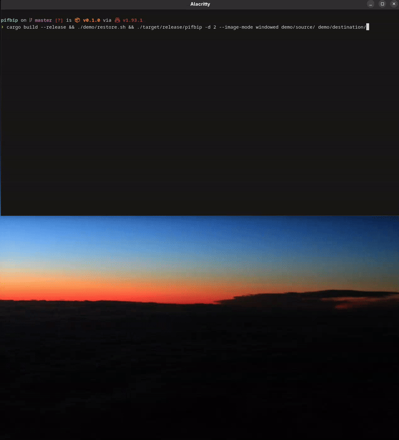

# pifbip — Put In Folder By Interactive Prompt

Fast bulk file sorting when there's no pattern and you need to decide manually.

For each file in the source folder, pifbip shows the filename and a preview, then prompts you to type a destination subfolder. As you type, existing folder names appear as fuzzy autocomplete suggestions. The file is moved instantly and the next one loads.


### Windowed mode (full resolution preview)



## Previews

- **Images** (jpg, png, gif, webp, bmp, etc.) — rendered directly in the terminal (kitty, sixel, or Unicode half-blocks)
- **Text files** (txt, md, csv, json, py, etc.) — first 10 and last 10 lines
- **Other files** — name, size, and MIME type

## Requirements

- Rust toolchain (for building)
- No external dependencies — image rendering and fuzzy matching are built in

## Installation

```bash
cargo build --release
```

The binary will be at `target/release/pifbip`. Copy it anywhere on your PATH.

## Usage

```bash
pifbip <source> <destination> [options]
```

### Options

| Flag | Description |
|---|---|
| `-d`, `--depth N` | How many levels deep to scan source subfolders for files. `0` (default) = only top-level files, `1` = include one level of subfolders, etc. |
| `--image-mode MODE` | Image preview mode: `auto` (default), `chafa`, `viuer`, or `windowed`. `auto` uses chafa if available, otherwise viuer. `windowed` opens a GUI preview window at full resolution. |
| `-h`, `--help` | Show help message and exit |

### Examples

```bash
# Sort files from Downloads into organized folders
pifbip ~/Downloads ~/Sorted

# Include files from subfolders one level deep
pifbip ~/Downloads ~/Sorted -d 1

# Scan all nested subfolders up to 3 levels
pifbip ~/Downloads ~/Sorted -d 3
```

### Controls

- Type a folder name and press **Enter** to move the file there (created if it doesn't exist)
- **Tab** to accept the selected autocomplete suggestion
- **Up/Down** arrows to navigate suggestions
- Press **Enter** on empty input to skip a file
- Press **Ctrl+C** or **Esc** to quit at any time

## Demo

A `demo/` folder is included with sample source files. After sorting, run the restore script to reset:

```bash
./demo/restore.sh
```

To re-record the demo GIF (requires [VHS](https://github.com/charmbracelet/vhs)):

```bash
./demo/restore.sh
vhs demo/demo.tape
```
