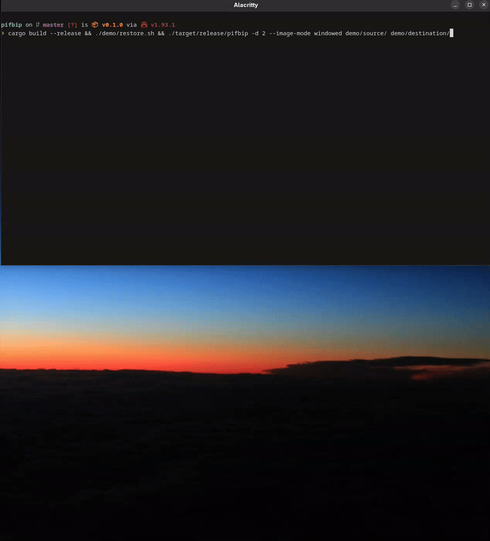

# pifbip — Put In Folder By Interactive Prompt

Fast bulk file sorting when there's no pattern and you need to decide manually.

For each file in the source folder, pifbip shows the filename and a preview, then prompts you to type a destination subfolder. As you type, existing folder names appear as fuzzy autocomplete suggestions. The file is moved instantly and the next one loads.

pifbip ships as two front-ends over a shared core (`pifbip-core`):

- **`pifbip-cli`** — the terminal experience shown below.
- **`pifbip-gui`** — a dark-themed desktop window (built with [iced](https://iced.rs)): a file list and destination input with fuzzy autocomplete on the left, and a live preview of images, video, PDFs, and text on the right.


### Windowed mode (full resolution preview)



## Previews

- **Images** (jpg, png, gif, webp, bmp, etc.) — rendered directly in the terminal (kitty, sixel, or Unicode half-blocks)
- **Text files** (txt, md, csv, json, py, etc.) — first 10 and last 10 lines
- **Other files** — name, size, and MIME type

## Requirements

- Rust toolchain (for building)
- No external dependencies — image rendering and fuzzy matching are built in

## Installation

```bash
cargo build --release
```

This produces both binaries: `target/release/pifbip-cli` and `target/release/pifbip-gui`. Copy either anywhere on your PATH.

## Usage

### CLI

```bash
pifbip-cli <source> <destination> [options]
```

### Options

| Flag | Description |
|---|---|
| `-d`, `--depth N` | How many levels deep to scan source subfolders for files. `0` (default) = only top-level files, `1` = include one level of subfolders, etc. |
| `--image-mode MODE` | Image preview mode: `auto` (default), `chafa`, `viuer`, or `windowed`. `auto` uses chafa if available, otherwise viuer. `windowed` opens a GUI preview window at full resolution. |
| `-h`, `--help` | Show help message and exit |

### Examples

```bash
# Sort files from Downloads into organized folders
pifbip-cli ~/Downloads ~/Sorted

# Include files from subfolders one level deep
pifbip-cli ~/Downloads ~/Sorted -d 1

# Scan all nested subfolders up to 3 levels
pifbip-cli ~/Downloads ~/Sorted -d 3
```

### Controls

- Type a folder name and press **Enter** to move the file there (created if it doesn't exist)
- **Tab** to accept the selected autocomplete suggestion
- **Up/Down** arrows to navigate suggestions (list uses full terminal height)
- **Left** arrow to go back to the previous file (undoes the move)
- **Right** arrow or empty **Enter** to skip a file
- **Ctrl+R** to rename the selected folder
- Press **Ctrl+C** or **Esc** to quit at any time

### Smart sorting

Recently used folders appear first in the suggestion list, so folders you're actively sorting into stay at the top.

### GUI

```bash
# Launch and pick folders in the window
pifbip-gui

# …or pre-fill the source/destination from the command line
pifbip-gui ~/Downloads ~/Sorted -d 2
```

On launch the GUI shows a setup screen with two folder fields (paste a full path or click **Browse…**) and a scan-depth field. After **Start sorting**, the left panel lists the files and a text input offers the same fuzzy autocomplete as the CLI; the right panel previews the current file (image, video, PDF first page, or text). Use the **Move**, **Skip**, and **Back** buttons, or **Enter** to move, **Tab** to accept a suggestion, and **↑/↓** to navigate suggestions.

## Testing

```bash
cargo test
```

This runs both the Rust unit tests and an end-to-end interactive CLI scenario defined in `tests/scenarios/demo.toml`.
The `demo/demo.tape` file remains the recorded demo script for VHS.

## Demo

A `demo/` folder is included with sample source files. After sorting, run the restore script to reset:

```bash
./demo/restore.sh
```

To re-record the demo GIF (requires [VHS](https://github.com/charmbracelet/vhs)):

```bash
./demo/restore.sh
vhs demo/demo.tape
```
